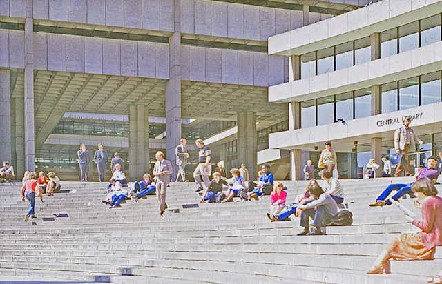
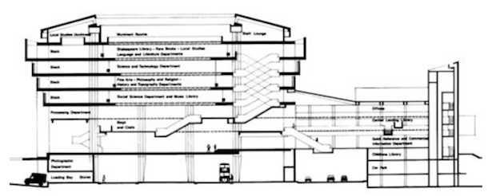
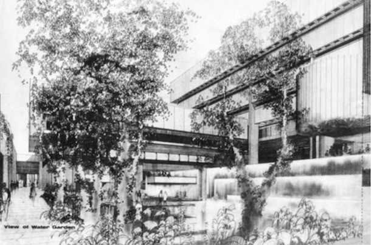
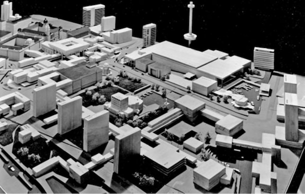

Would Le Corbusier save Birmingham Central Library?
===================================================

.. figure:: clean_in_the_80s.jpg

    A clean, unmodified Central Library on a sunny day in 1982. [#]_.

Birmingham Central Library was completed in 1974, the eastern bound of a much larger civic centre which has never been completed. Less than forty years later, in 2013, the building has been emptied of its precious horde of books and historical achives. The building now functions as nothing more than a massive decaying concrete roof over a tacky and windy downscale row of shops and cafes.  Despite the best efforts of English Heritage, the 20th Centry Society and a cadre of passionate objecters [#]_, the building is scheduled for demolition. 

A humanist, cubist, modernist building for the future.
------------------------------------------------------
     In the last fifty years steel and concrete have brought new conquests, which are the index of a greater capacity for construction, and of an architecture in which the old codes have been overturned.
-- Le Corbusier, Towards an Architecture, 1923

Architect John Madin had a vision for the future.
The town was growing fast.
The pre-war city was decimated by the war.
It was an industrial city with lots of poverty.
The librarian shared the vision.
Had a view into the future, understood computerisation, the wider remit of a library.

    The place looked quite upbeat and modern in the 70s.

Le Corbusier was a architectural prophet. 
Town planning was an emerging humanist art.
The architect was to be the savior of the city.

The vision Le Corbusier foretold was domination of the automobile.
Understood the fumes and filth of the things would suffocate the city.
His solution was a traffic graded metropolis.
Buildings would be suspended atop polis, columns with vehicles running beneath.
The pedestrian segmented from the subterranean zone of cars, utilities, sewage pipes.

    The original plan echoed Le Corbusier's vision of a city raised above the ground, with a bus station planned in a subterranean zone alongside the current road tunnels. [#]_

The champion of the simple and unadorned, ever mindful of mass, surface and restraining lines.
Against a garden with waterfalls and stuff.

    They also wanted to cover the thing in marble, but the council could not afford it.

A fly in the ointment of the natural order of the city
------------------------------------------------------
    Without plan there can be neither grandeur of aim and expression, nor rhythm, nor mass, nor coherence. 
-- Le Corbusier, Towards an Architecture, 1923

    The library was suppose to be the start of something.

Inner ringroad.
Grand plan to leverage the destruction of the city in the war.
And the coming of the automobile.
And the position of chief supervisor of works for the City which Marzoni had.

Along with a grand plan to remodel the city with a civic centre.
The West Midlands was booming into the 70s.
The end of the party, the oil crisis etc.
Could not afford to complete the Civic centre as planned.

Madin was Marzoni's protoge.
An elderly Madin criticised him as just a road engineer.

Plans for roads were not accomplished anywhere else.
The ringways plan in London was stopped as it would have destroyed much of the city.

Their vision failed.
The centre of a city is no place for the car.
Le Corbusier had seen that the pedestrian, the inhabitant of the city needed to be protected from the car.
He did not go far enough, grading was not far enough.
The city is not the place for the car.

In the 90s the planners realised this and Birmingham's town center was pedestrianised.
Centenary square was finished in a sense with the addition of the Symphony Hall.
Subways blocked the natural passage from the reinvigorated Brindley Place to the rest of the city.

Installed a roof and changed the space from a civic to a commercial one,
Stream of cheap tatty shops.

Queensway lost favour.
Took out the Bull Street Hump.
The Masshouse Circus.
Downgraded the Smallbrook Queensway.

Destruction of what went before
-------------------------------
    The “styles” are a lie. Style is a unity of principle animating all the work of an epoch, the result of a state of mind which has its own special character.
-- Le Corbusier, Towards an Architecture, 1923

.. raw:: html

    <iframe src="//player.vimeo.com/video/7329952" width="500" height="375" frameborder="0"> </iframe>

Le Corbusier is saying that the work of an epoch has its own special character.
Modernism, brutalism is the result of a specific time.
Driven by the white heat of technology.
Turning the back on the inequalities and squalor of the past.
Expession of a time, a way of thinking that cannot be recovered.

Le Corbusier says that Art is the application of knowledge to a conception.
This conception is a product of its time.
We cannot replay or recreate it.
Once lost the essence of the conception is gone.

Divert - there is a deeper tragedy.
The old library.
Other buildings.
Two wrongs don't make a right.

Conclusion
----------
    We throw the out-of-date tool on the scrap-heap: the carbine, the culverin, the growler and the old locomotive. This action is a manifestation of health, of moral health, of morale also; it is not right that we should produce bad things because of a bad tool; nor is it right that we should waste our energy, our health and our courage because of a bad tool; it must be thrown away and replaced.
-- Le Corbusier, Towards an Architecture, 1923

The thing is a mess. It has been abandoned already. It blocks the natural flow of the city. It should be pulled down.

Perhaps if it were placed somewhere else. But this is the real world.

Le Corbusier was wrong in his analysis of the motorcar. The city is a not a place for the motorcar. People need more than un-adorned concrete. Perhaps if they had the waterfalls, or the marble.

Marzoni was wrong too, the forward thing. People should not be sentimental about old buildings.

--------

References & Links
------------------
.. [#] This photo is taken from a series of Photos on Flickr which were taken of Birmingham City Centre in 1982: http://bit.ly/1iGDkxX
.. [#] One particularily passionate, and frankly pretty odd plea to retain the structure is this one: http://vimeo.com/45202945
.. [#] This particular image and many other great ones of the Central Library is available from: http://www.john-madin.info/

.. author:: default
.. categories:: none
.. tags:: none
.. comments::
