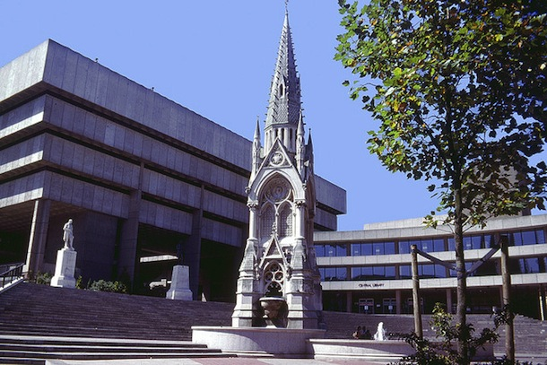

Would Le Corbusier save Birmingham Central Library?
===================================================

    A clean, unmodified Central Library on a sunny day in 1982. Photo Credit: Dartsmaster [#]_.

And then one would start a paragraph here I suppose.

.. [#] This photo is taken from a series of Photos on Flickr which were taken of Birmingham City Centre in 1982: http://www.flickr.com/photos/dartsmaster/209004088/sizes/l/in/set-72157594227596604/

.. author:: default
.. categories:: none
.. tags:: none
.. comments::
