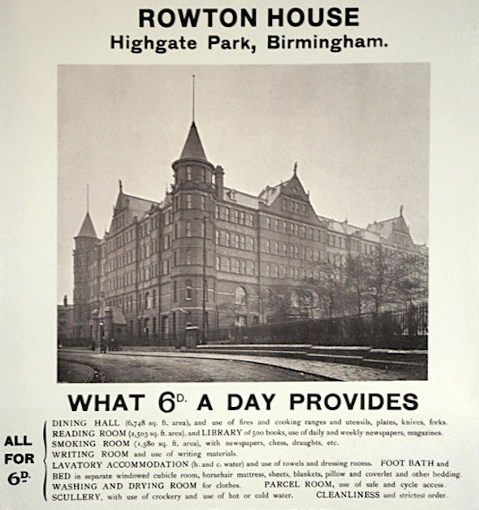
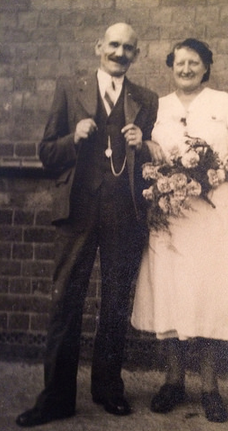

Fred Field, and Frederick Field Snr.
====================================

    My grandad Fred liked Budgies

Although my grandfather died in the 1990s, I remember him quite well from my experiences with him as a boy and the things that my Mom and Gran have told me about him since. He was a tall man, born in Smallheath in Birmingham to a working class family, married to a devoted wife, father of two girls and a much younger son. He was a committed trade-union organiser at the Longbridge Motor Plant, a keen gardener in his spare time and the keeper of an aviary of budgerigars. 

His biggest vice from what I can tell was smoking which probably eventually contributed to his death. The elder members of my family who were close to him as adults recall him as a moral, thoughtful and dilligent man. To my mother he was a key inspiration to her career as a teacher in inner city Birmingham and after her retirement his memory a spur to her voluntary work with vulnerable people.

In recent years I've been working near Smallheath, in Central Birmingham. Although it is a place I've been familiar with since I was a child, after living in lots of other places its been interesting to see the place where my family originated. 

Time is a very strange thing. I was recently talking to my Grandmother who is almost 90 years old. She told me that as a child when she learnt about things that happened two hundred years ago it felt terribly far in the past. Now she says that sense of distance has been shattered as she herself has been alive for almost half of that period of time. 
In terms of evolution both of the species and exchange of family traits 200 years is a heartbeat or a blink of the eye. However, in terms of the political and technological currents which still animate the world today, glimpses of the near past can seem to enrich and illuminate our understanding, or at least the subject gives this illusion to me.

Birmingham emerged as one of the first industrial centres, due to its proximity to raw materials smelted in the Black Country. When the technologies of the Industrial Revolution took hold its population exploded in a manner repeated since across the globe. Workers displaced by improved technology in the agarian economy of the countryside travelled to Birmingham and other industrial cities to find work, and in some cases to prevent starvation. 

Enterprenuers, capitalists and landowners co-operated to harness the twin influxes of cheap labour and rapidly more complex and efficient technology by building workshops, canals, railways, factories, banks and intermingled amongst it all rows of cheap densely packed housing. Birmingham was known as the workshop of the world during this time and produced metal goods in quantities unseen before, which were exported by the merchant navy to a planet about to move from a dormant and agarian state to the technologically enlivened modern world.

The censuses are extraordinarily detailed catalogues of the urban populace of this time. Kept at least in part as an inventory of the British Empire's potential might should she need to go to war, each man, woman and child is recorded along with their profession or trade, address, age and details as to any mental deficiency. 

Tracing this lineage back is somewhat tricky not least due to the very common names which my ancesters had. For example my Great-Grandmother Lily Jones was one of eleven Lily Joneses in the city at the time and one of three who were born in the same year. However, by correlating details in the living memory such as addresses and the names of siblings it is possible to find my both my Great-Grandparents in the census of 1911. From there I've traced back to 1901, 1891, 1881 and occasionally, and with great care, to the censuses of the mid-nineteenth century when the Industrial Revolution in Birmingham was at its peak.

One impression I could draw from the censuses is that Birmingham had a class of metalworkers and gunmakers who lived in densely packed rented accommodation, that women, especially girls participated in the work, involvement in the trade was regularly passed from generation to generation, marriages were frequently to people who lived on the next street, and lots of children died before they reached school age. 

Illustrating this, my Grandfather Fred's Grandfather (Thomas) was born in 1861 and worked as a Nail Caster (these would be individually cast nails, before modern wire nails were developed). He lived on Vincent Street near Smallheath in 1891 with his wife in a back-to-back house and seems to have lost several young children between the 1881 and 1891 censuses. 

Similarly, Thomas Pennell, my Grandmother's Great Grandfather was born in 1831 and worked as a Gun Maker (which was a big industry in the city feeding the global empire of the time). He lived in the St George district in 1861 with his wife in a back-to-back house and seems to have lost several children between the 1851 and 1861 censuses. Both of these Thomases would have descendants whom continued to live their lives in the area around Smallheath.

My Grandparents married in the late 1940s after the disruption of the Second World War. In the common manner of the time my Grandparents went to live with my Granddad Fred's parents Lily and Frederick Snr. Finding this out made me ask my Grandmother what she remembers about my Grandfather's parents and the time she and Fred spent living with them  right after they had married. 

I suppose my assumption was that Fred's Dad was the template of his son, idealistic and determined, upright and inspirational. Sadly no, my Grandmother tells me that my Grandad's Dad was 'a horrible man', albeit a dapper and intruiging one, who seemingly never had any money, could be a pain in the bum, and liked a drink a little too much.

He was born in 1891 to Thomas and Elisabeth Field. They were both in their 30s and lived in Windsor Place, a complex of back-to-back houses set around a 'court' on Vincent Street, in the Balsall Heath area Birmingham. Frederick had three elder siblings, Herbert, who was 7 when he was born, Thomas, who was 4 and Annie who was 3 years old. 

In 1911, by the time Fred was 20 years old, his older sister Annie had died and he had three additional brothers and sisters, Leonard, Winnefred and Beatrice. The cast nail industry was by this time going into decline and Fred Snr's father, now 50 years of age still worked in that industry. His two elder brothers, Herbert and Leonard were metalworkers also and had moved out of the family home.

The backdrop of this time was the rise of German industry as a competitor to that of Britain, the rise of Imperial Germany and the insane devastation of the First World War. One thing the British Empire did incredibly well was records and Fred's war records have been preserved (many were burned) and provide an incredible window into his life between 1918 and around 1930.

    Fred was living here when he enlisted.

Fred was conscripted in 1918, four years into the war. Many of the 'pals regiments' who marched off to volenteer in 1914 would have been dead by this stage so perhaps this shows some good sense. Fred lists his place of abode as the 'Rowton House' in Central Birmingham, a 6d per night hostelry for Navvies, Irish and "down and outs". He joins the Tank Corps Central Workshops and is listed as 5’2” tall (his son was 6'1") with a 'Girth when fully expanded' of 37". 

    This is a picture of the Central Workshops in 1917.

Luckily the war was over by the end of the year, however Fred was retained in Tank Corps into 1919. Amazingly his courtship and marriage to his wife is documented through a leave request from January 1919 which is evidenced by a copy of his marriage certificate. The certificate shows his wedding to Lily Jones, my Great Grandmother, whom must have been pregnant at the wedding as Lillian Rosamund Field was born seven months later on 1 Jul 1919. Sadly their first child died after only one day in this world.

    Here he is. I think with his sister?

.. author:: default
.. categories:: none
.. tags:: none
.. comments::
