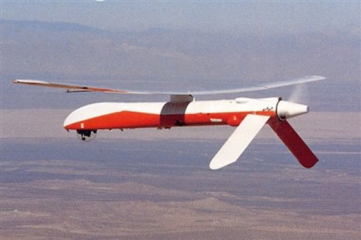
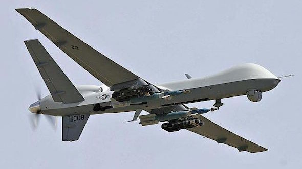
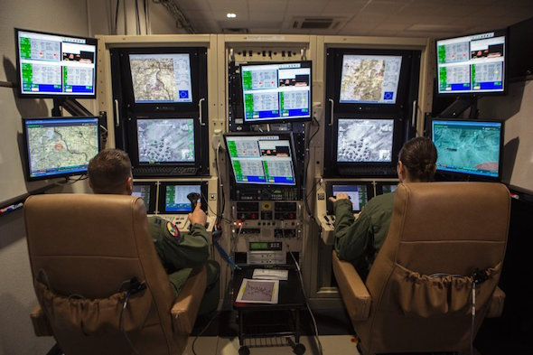

Instead of the cross, the albatross, about my neck was hung.
============================================================

    Abraham Karem an Isreali engineer started working on drones in the 70s.

During the cold war the United States established a technological research organisation called DARPA to "prevent strategic surprise". In 1982 they provided a grant to an aerospace engineer called Abraham Karem, trying to build reliable robotic aircraft that could fly for very long periods at high altitude. Karem had moved to the United States after working for the Isreali Airforce building decoy rockets that could pinpoint enemy antiaircraft defences during the 1973 Yom Kippur war. 

The CIA started to operationalise Karem's drones in the early nineties. After the fall of the Berlin Wall, the US military intervened in Yugoslavia, a former Soviet Soviet satellite. The Gnat 750 drone was able to relay live reconnaissance feeds to the Pentagon via a relay aircraft and satellite ground stations. Over the next ten years Karem's team, now working at a firm called General Atomics, enhanced the drones by significantly improving their endurance and imaging capabilities and incorporating direct satellite links.

    The predator drone has a pair of laser guided hellfire missiles attached to it.

After a critical US Congress commitee report in the mid-seventies the CIA was banned from assassinating people in sovereign territory. After September 11th the US executive signed a memorandum ordering the CIA to find and kill the leaders of the group of Islamic fundamentalists who claimed responsibility for the attacks. This executive order combined with the US interventionist wars in Afghanistan and Iraq led to enormous growth in the use of drones for assassination as well as reconnaissance purposes.

The predator drone, or General Atomics MQ-1 is a development of the Gnat 750 capable of travelling over 400 miles to a target, loitering for upto 14 hours and then returning to base. Unlike the Gnat, predators are equipped with Hellfire missiles, a relatively cheap air-to-surface missile developed in the 1980s to attack tanks and armoured fighting vehicles. The operator of the MQ-1 uses a targetting laser beamed from the drone to guide the hellfire at its intended target. Despite being designed as an anti-tank missile the hellfire is an effective anti-personnel weapon.

    Drone pilots work in computerised installations which are housed in shipping containers.

In November 2002 a predator was launched from a former French Foreign Legion base in Djibouti and crossed the Bab-el-Mandeb strait to enter Yemen. Having gained blessing from the government of Yemen, the CIA carried out the first drone based 'targetted killing' outside the warzone in Afghanistan. The target was Qaed Salim Sinan al-Harethi, positively identified by the NSA using signals from the cellphone in the back of his SUV. Al-Harethi was a Yemeni citizen whom had been involved in the bombing of a US Navy ship in Yeman in 2000.

One US military base where predator drones are flown from is Creech Air Force base in Nevada. Although early drone pilots were drawn from F-15 pilots and other manned aircraft squadrons, the US Air Force increasingly turns to video games conferences and meetups to find new recruits. The predator is partly autonomous and therefore capable of operating on autopilot when moving from location to location. Manual control is relayed from computerised control panels in the United States via satalite links to drones over the Middle East, Asia and Africa.

.. author:: default
.. categories:: none
.. tags:: none
.. comments::
